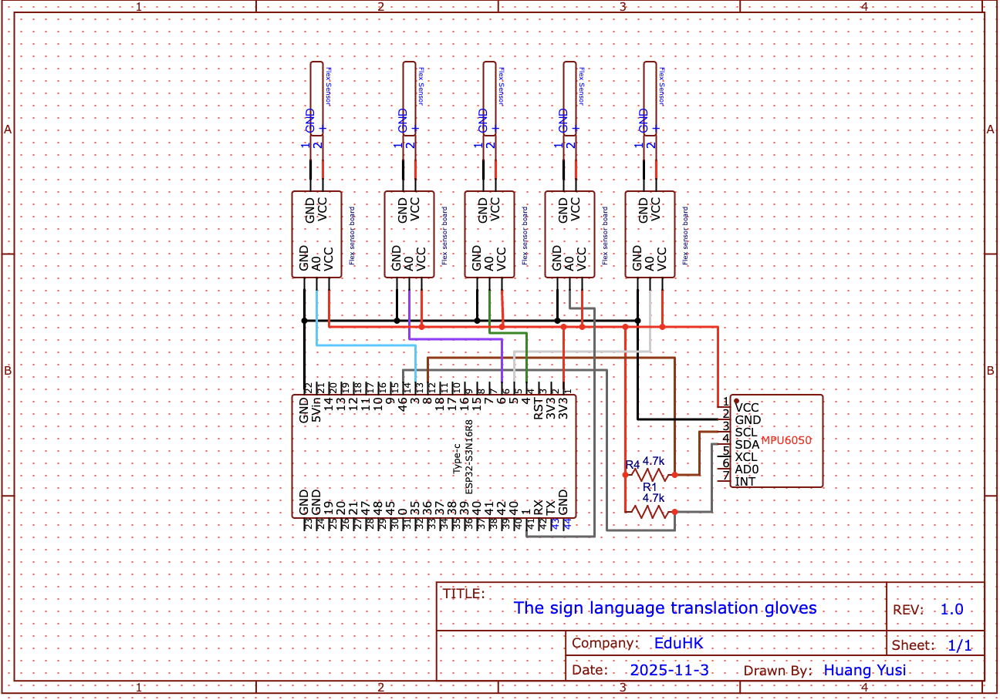

# Sign Language Translation Glove - ESP32 Firmware

Advanced gesture recognition system for sign language translation

## 🎯 Overview
This firmware implements a sophisticated gesture recognition system for a sign language translation glove, combining 5 flex sensors with an MPU6050 IMU to accurately recognize gestures in real-time.

# System Architecture

## HARDWARE LAYER
| Component | Description                         |
|-----------|-------------------------------------|
| Thumb     | Flex Sensor (GPIO7)                |
| Index     | Flex Sensor (GPIO1)                |
| Middle    | Flex Sensor (GPIO4)                |
| Ring      | Flex Sensor (GPIO6)                |
| Pinky     | Flex Sensor (GPIO3)                |

## PROCESSING LAYER
- MPU6050 (I2C: SDA - GPIO8, SCL - GPIO9)
- ESP32-N16R8 (Dual-core, Built-in BLE)
- 4.7V LiPo Battery with Type-C Charging

## COMMUNICATION LAYER
- BLE 5.0 → Mobile App (Flutter/Dart)
- Serial Output → Debug & Calibration

## Software Architecture
Sensor Data Acquisition: 10Hz sampling of 5 flex sensors + MPU6050

Data Filtering: Moving average + dead zone control algorithm

State Classification: Three-state mapping (0,1,2) for fingers and directions

Pattern Matching: Rule-based gesture recognition with confidence scoring

BLE Communication: Real-time data streaming to mobile application

Mobile Interface: Flutter app for gesture display and history

## 🔧 Implementation Details
### Hardware Components
| Component         | Quantity | Function                     | Connection Details                                    |
|-------------------|----------|------------------------------|------------------------------------------------------|
| ESP32-N16R8      | 1        | Main microcontroller         | VCC - 3.3V, GND, I2C pins                            |
| Flex Sensors      | 5        | Finger bending detection     | Analog pins 7, 1, 4, 6, 3 with voltage dividers     |
| MPU6050           | 1        | Hand orientation tracking     | SDA - GPIO8, SCL - GPIO9 with 4.7kΩ pull-up resistors|
| LiPo Battery      | 1        | Power supply                 | 4.7V with Type-C charging module                     |
| Resistors         | 2        | I2C pull-up resistors        | 4.7kΩ for SDA/SCL lines                              |

| Gesture | Finger Pattern [T,I,M,R,P] | Direction Pattern [X,Y,Z] | Recognition Logic                            |
|---------|-----------------------------|----------------------------|----------------------------------------------|
| Hello   | [2,2,2,2,2]                | [1,2,1]                   | All fingers straight + specific movement     |
| I       | [1,2,1,1,1]                | [2,2,2]                   | Mixed states with neutral direction          |
| D       | [1,1,1,1,1]                | [1,2,2]                   | All fingers approaching straight             |
| E       | [1,0,2,2,2]                | [0,2,1]                   | Unique thumb-index combination               |
| OK      | [1,1,2,2,2]                | [1,2,2]                   | Thumb-index circle formation                 |
| Thanks   | [1,0,1,1,1]                | [2,0,1]                   | Gratitude gesture pattern                    |
| You     | [1,2,1,1,1]                | [1,1,2]                   | Pointing gesture variant                     |

## Mobile Application

## Flutter App Features
- BLE device scanning and connection
- Real-time gesture display
- Translation history logging
- Simple, intuitive user interface
- Cross-platform compatibility (Android/iOS)

## 📊 Performance Evaluation

### Testing Methodology
- Each gesture tested 20 times
- Accuracy calculated as correct recognitions / total attempts
- Comparison between baseline and optimized versions
- Bluetooth connection reliability testing

